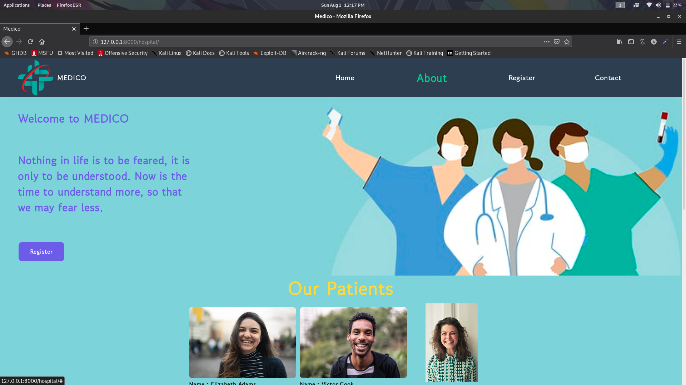
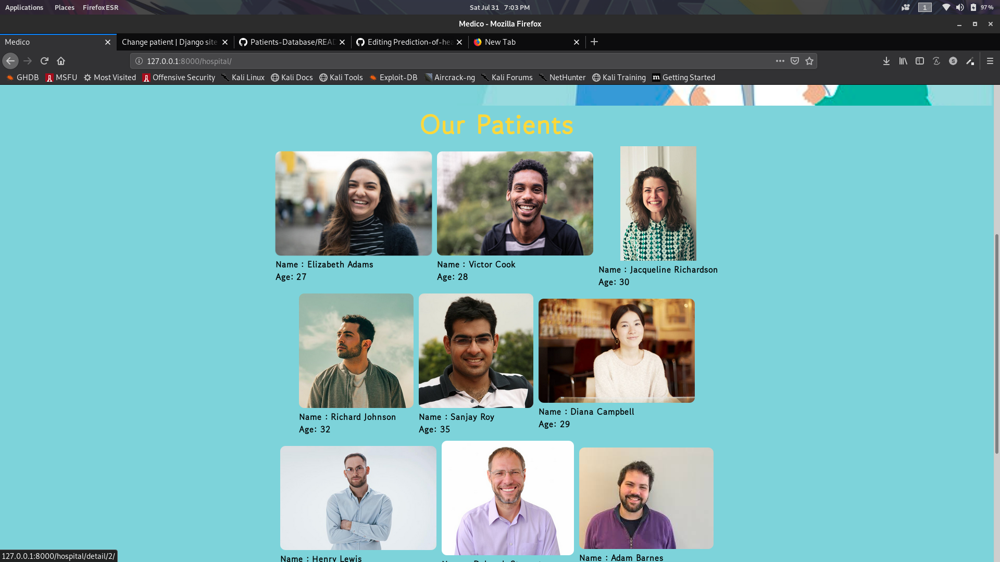
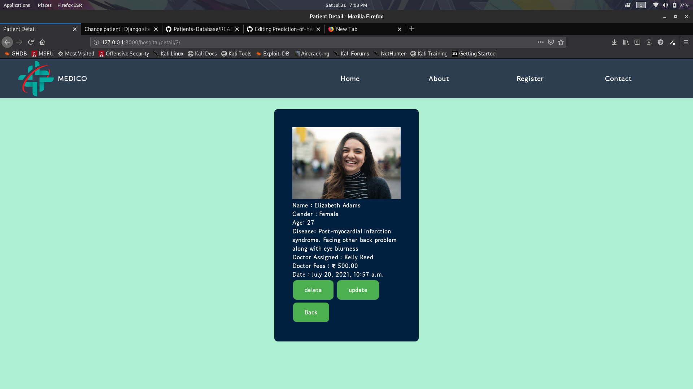
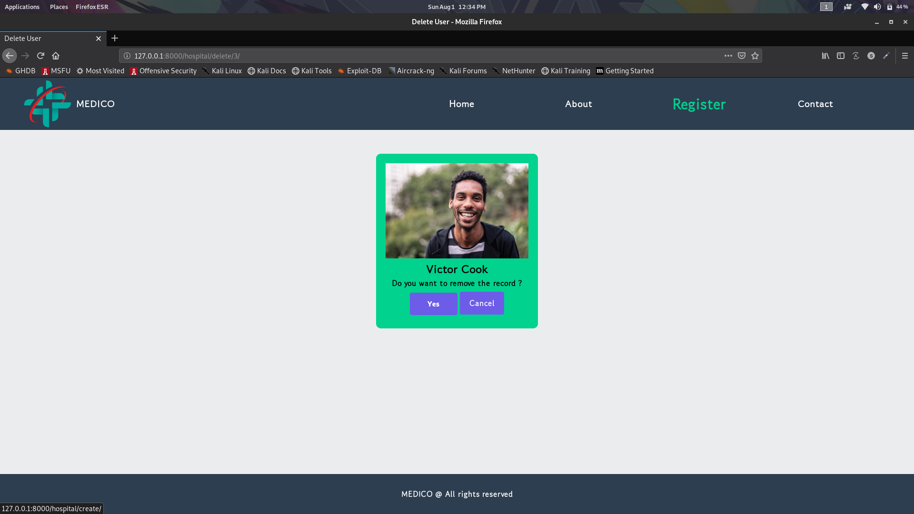

[](https://forthebadge.com)
[](https://forthebadge.com)
[](https://forthebadge.com)

# Patients-Database

<h2>Patient Datababe Website made using Django</h2><br>
<p>Here you can upload data of the patient and update the data and delete and view of details of the patients</p>

<p>hope you have installed django or else you can follow the command</p><br>
python -m pip install Django
<br>
<h3>Create the project</h3>
django-admin startproject hospital
<br>
<p>change the directory to the new project folder created</p>
<p>Then create the app for the project</p>
python3 manage.py startapp patient
<br>
<br>
<p>For quick overview of the project you can copy and overwrite the files and folder from the repo to the respective files of django that you have created</p>
<h3>How to run the django server</h3>
<p>now run the following commands</p>
python3 manage.py makemigrations 
python3 manage.py migrate <br> 
python manage.py runserver <br> 

<h2>To access the admin portal of Django</h2>

<p>follow the commands and give your own password and username</p>

<p>python3 manage.py createsuperuser</p>

<h2>Important code snippets</h2>

<p>forms.py</p>

```python
from django import forms
from .models import Patient
import datetime

class DateInput(forms.DateInput):
    input_type = 'date'

class PatientForm(forms.ModelForm):
    class Meta:
        model = Patient
        fields = [
            'First_Name',
            'Last_Name',
            'Gender',
            'Age',
            'Disease',
            'Doctor_name',
            'Doctor_fees',
            'Starting_data_of_meds',
            'Image'
        ]
        
class RawPatientForm(forms.Form):
    
    GENDER_CHOICES = [
        ('Male','Male'),
        ('Female','Female'),
    ]
    First_Name = forms.CharField(widget = forms.TextInput(attrs= {'placeholder': 'Enter First Name'}))
    Last_Name = forms.CharField(widget = forms.TextInput(attrs= {'placeholder': 'Enter Last Name'}))
    Gender = forms.ChoiceField(choices=GENDER_CHOICES)
    Age = forms.IntegerField(widget = forms.NumberInput(attrs={'placeholder':'Enter your Age'}))
    Disease = forms.CharField(widget = forms.Textarea(attrs={'rows': 4 , 'cols': 50,'placeholder':'Enter your Problems / Disease'}))
    Doctor_name = forms.CharField(widget = forms.TextInput(attrs={'placeholder': 'Enter your Doctor Name'}))
    Doctor_fees = forms.DecimalField(initial = 500.00)
    Starting_data_of_meds = forms.DateField(input_formats = ['%Y-%m-%d'],widget = DateInput)
    Image = forms.FileField()
    
```
<p>models.py</p><br>
<p>Dynamic url is used to access the perticular id of the patient</p>

```python
from django.db import models
from django.urls import reverse

class Patient(models.Model):
    GENDER_CHOICES = [
        ('Male','Male'),
        ('Female','Female'),
    ]
    
    First_Name = models.CharField(max_length  = 120)
    Last_Name = models.CharField(max_length = 120)
    Gender = models.CharField(max_length = 10, choices = GENDER_CHOICES)
    Age = models.IntegerField()
    Disease = models.TextField()
    Doctor_name = models.CharField(max_length = 200)
    Doctor_fees = models.DecimalField(decimal_places=2,max_digits=100000,default = 500.00)
    Starting_data_of_meds = models.DateTimeField(null = True,blank = True)
    Image = models.FileField(upload_to='images/',default = '')
    
    def __str__(self):
        return self.First_Name
    def get_absolute_url(self):
        return reverse("patient:detail", kwargs={"pk": self.pk})
    
```

<p>views.py</p>

```python

from django.shortcuts import render,get_object_or_404,redirect
from django.views.generic import ListView,DetailView
from .models import Patient
from .forms import PatientForm ,RawPatientForm
import datetime

class HomeView(ListView):
    model = Patient
    template_name = "patient/home.html"

class PatientDetailView(DetailView):
    model = Patient
    template_name = "patient/detail.html"
    
def patient_create_view(request):
    
    
    med_form = RawPatientForm()
    if request.method == "POST" or None:
        med_form = RawPatientForm(request.POST or None , request.FILES or None)
        if med_form.is_valid():
            Patient.objects.create(**med_form.cleaned_data)
            return redirect('../')
    context = {'form':med_form}
    

    return render(request,"patient/create.html",context)

def patient_delete_view(request,pk):
    patient = get_object_or_404(Patient,pk = pk)
    if request.method == "POST":
        patient.delete()
        return redirect('../../')
    context = {
        "patient":patient
    }
    return render(request,"patient/delete.html",context)

def patient_update_view(request,pk):
    patient = get_object_or_404(Patient,pk = pk)
    med_form = PatientForm(request.POST or None,request.FILES or None , instance = patient)
    if med_form.is_valid():
        med_form.save()
        return redirect('../../')
    context = {
        'form':med_form
    }
    return render(request,"patient/update.html",context)
    
```
<p>Some changes in settings.py to needed</p>

```python
import os

INSTALLED_APPS = [
    'django.contrib.admin',
    'django.contrib.auth',
    'django.contrib.contenttypes',
    'django.contrib.sessions',
    'django.contrib.messages',
    'django.contrib.staticfiles',
    'patient'
]

STATICFILES_DIRS = [
    os.path.join(BASE_DIR, "static"),
]

    {
        'BACKEND': 'django.template.backends.django.DjangoTemplates',
        'DIRS': [os.path.join(BASE_DIR,"templates")],
        'APP_DIRS': True,
        'OPTIONS': {
            'context_processors': [
                'django.template.context_processors.debug',
                'django.template.context_processors.request',
                'django.contrib.auth.context_processors.auth',
                'django.contrib.messages.context_processors.messages',
                'django.template.context_processors.media',
            ],
        },
    },
]

TIME_ZONE = 'Asia/Kolkata'

MEDIA_ROOT = os.path.join(BASE_DIR,'media/')
MEDIA_URL = '/media/'

```
<p> I have include my own urls.py in paient folder</p>

```python
from django.urls import path
from .views import HomeView,PatientDetailView,patient_create_view,patient_delete_view,patient_update_view

app_name = 'patient'

urlpatterns = [
    path('',HomeView.as_view(),name = 'home'),
    path('detail/<int:pk>/',PatientDetailView.as_view(),name = 'detail'),
    path('create/',patient_create_view,name = 'create'),
    path('delete/<int:pk>/',patient_delete_view,name = 'delete'),
    path('update/<int:pk>/',patient_update_view,name = 'update')
]

```
<p>url patterns are set according to the dynamic url created in models.py</p>

<h2>Few Screenshot of the Project</h2>

<p> display patients (home.html)</p>





<p>Detail view of the perticular patient (detail.html)</p>



<p>delete page</p>



<h2>Contributions to this project is highly appreciable</p>
